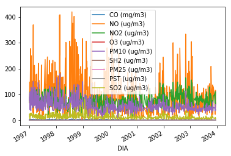
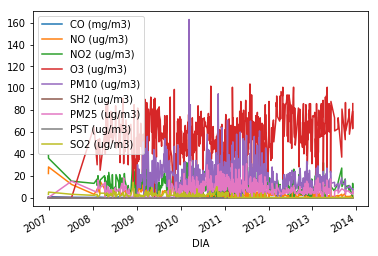
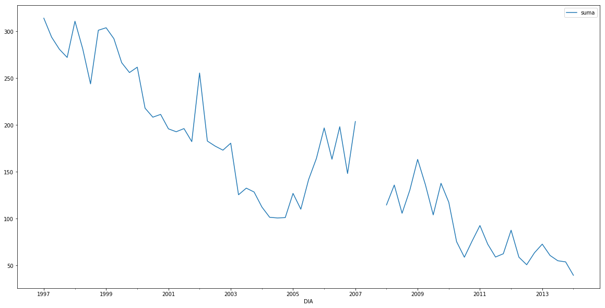
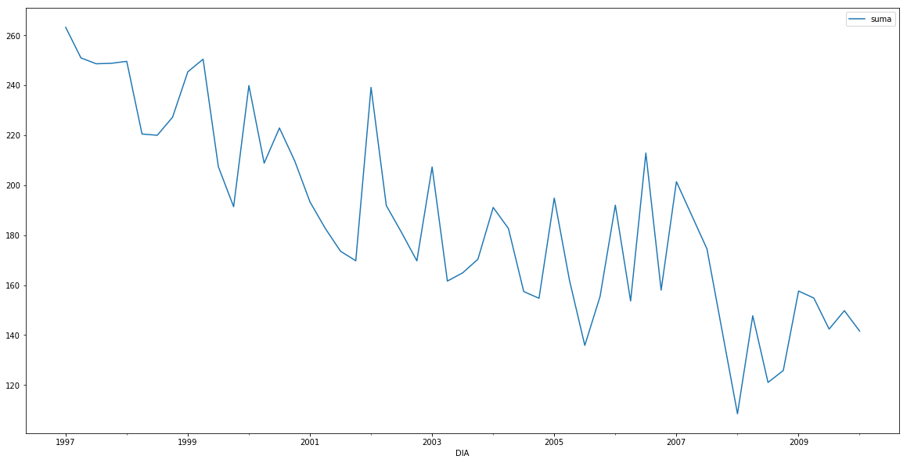
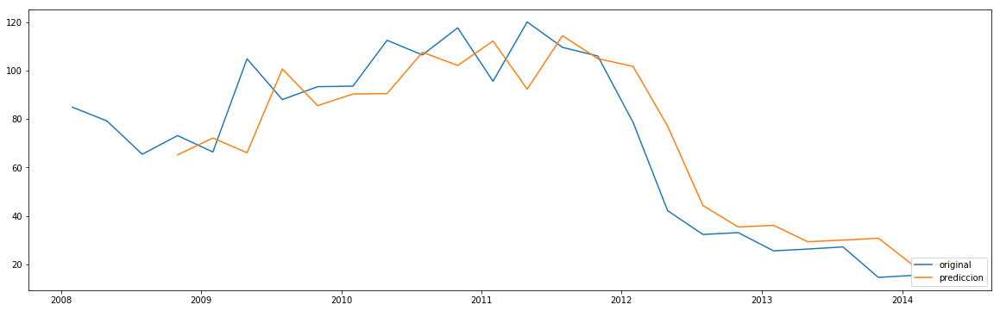
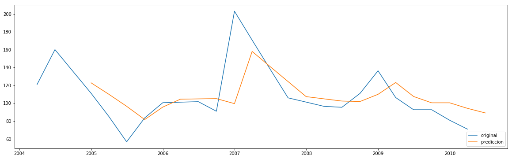
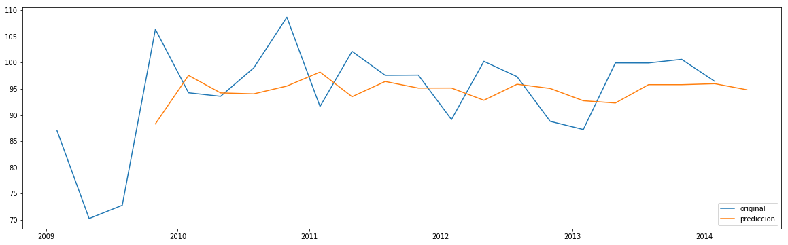

# Calidad del aire


```python
import pandas as pd
import numpy as np
import matplotlib.pyplot as plt
```

## Cargamos los datos


```python
ts = pd.read_csv("calidad_del_aire_cyl_1997_2013.csv",
                sep = ";",
                parse_dates = [0],
                index_col = 0)
```

    /home/luis/anaconda3/lib/python3.7/site-packages/IPython/core/interactiveshell.py:2785: DtypeWarning: Columns (6,8) have mixed types. Specify dtype option on import or set low_memory=False.
      interactivity=interactivity, compiler=compiler, result=result)


```python
ts.head()
```


<div>
<style scoped>
    .dataframe tbody tr th:only-of-type {
        vertical-align: middle;
    }

    .dataframe tbody tr th {
        vertical-align: top;
    }

    .dataframe thead th {
        text-align: right;
    }
</style>
<table border="1" class="dataframe">
  <thead>
    <tr style="text-align: right;">
      <th></th>
      <th>CO (mg/m3)</th>
      <th>NO (ug/m3)</th>
      <th>NO2 (ug/m3)</th>
      <th>O3 (ug/m3)</th>
      <th>PM10 (ug/m3)</th>
      <th>SH2 (ug/m3)</th>
      <th>PM25 (ug/m3)</th>
      <th>PST (ug/m3)</th>
      <th>SO2 (ug/m3)</th>
      <th>PROVINCIA</th>
      <th>ESTACIÓN</th>
    </tr>
    <tr>
      <th>DIA</th>
      <th></th>
      <th></th>
      <th></th>
      <th></th>
      <th></th>
      <th></th>
      <th></th>
      <th></th>
      <th></th>
      <th></th>
      <th></th>
    </tr>
  </thead>
  <tbody>
    <tr>
      <th>1997-01-01</th>
      <td>1.2</td>
      <td>12</td>
      <td>33</td>
      <td>63</td>
      <td>56</td>
      <td>NaN</td>
      <td>NaN</td>
      <td>NaN</td>
      <td>19</td>
      <td>ÁVILA</td>
      <td>Ávila</td>
    </tr>
    <tr>
      <th>1997-02-01</th>
      <td>1.3</td>
      <td>15</td>
      <td>35</td>
      <td>59</td>
      <td>47</td>
      <td>NaN</td>
      <td>NaN</td>
      <td>NaN</td>
      <td>17</td>
      <td>ÁVILA</td>
      <td>Ávila</td>
    </tr>
    <tr>
      <th>1997-03-01</th>
      <td>1.5</td>
      <td>18</td>
      <td>43</td>
      <td>54</td>
      <td>65</td>
      <td>NaN</td>
      <td>NaN</td>
      <td>NaN</td>
      <td>19</td>
      <td>ÁVILA</td>
      <td>Ávila</td>
    </tr>
    <tr>
      <th>1997-04-01</th>
      <td>1.6</td>
      <td>56</td>
      <td>73</td>
      <td>50</td>
      <td>74</td>
      <td>NaN</td>
      <td>NaN</td>
      <td>NaN</td>
      <td>22</td>
      <td>ÁVILA</td>
      <td>Ávila</td>
    </tr>
    <tr>
      <th>1997-05-01</th>
      <td>1.4</td>
      <td>11</td>
      <td>33</td>
      <td>63</td>
      <td>54</td>
      <td>NaN</td>
      <td>NaN</td>
      <td>NaN</td>
      <td>18</td>
      <td>ÁVILA</td>
      <td>Ávila</td>
    </tr>
  </tbody>
</table>
</div>


```python
ts.shape
```


    (153120, 11)


## Se quitan los datos que no sirven


```python
ts = ts.drop(ts[ts["CO (mg/m3)"] == "No cumple el anexo IV de la Decisión del Consejo 97/101/CE"].index)
ts = ts.drop(ts[ts["NO (ug/m3)"] == "No cumple el anexo IV de la Decisión del Consejo 97/101/CE"].index)
ts = ts.drop(ts[ts["NO2 (ug/m3)"] == "No cumple el anexo IV de la Decisión del Consejo 97/101/CE"].index)
ts = ts.drop(ts[ts["O3 (ug/m3)"] == "No cumple el anexo IV de la Decisión del Consejo 97/101/CE"].index)
ts = ts.drop(ts[ts["PM10 (ug/m3)"] == "No cumple el anexo IV de la Decisión del Consejo 97/101/CE"].index)
ts = ts.drop(ts[ts["SH2 (ug/m3)"] == "No cumple el anexo IV de la Decisión del Consejo 97/101/CE"].index)
ts = ts.drop(ts[ts["PM25 (ug/m3)"] == "No cumple el anexo IV de la Decisión del Consejo 97/101/CE"].index)
ts = ts.drop(ts[ts["PST (ug/m3)"] == "No cumple el anexo IV de la Decisión del Consejo 97/101/CE"].index)
ts = ts.drop(ts[ts["SO2 (ug/m3)"] == "No cumple el anexo IV de la Decisión del Consejo 97/101/CE"].index)
ts = ts.astype({"CO (mg/m3)": float})
ts = ts.astype({"NO (ug/m3)": float})
ts = ts.astype({"NO2 (ug/m3)": float})
ts = ts.astype({"O3 (ug/m3)": float})
ts = ts.astype({"PM10 (ug/m3)": float})
ts = ts.astype({"SH2 (ug/m3)": float})
ts = ts.astype({"PM25 (ug/m3)": float})
ts = ts.astype({"PST (ug/m3)": float})
ts = ts.astype({"SO2 (ug/m3)": float})
ts.shape
```


    (51198, 11)


```python
ts.dtypes
```


    CO (mg/m3)      float64
    NO (ug/m3)      float64
    NO2 (ug/m3)     float64
    O3 (ug/m3)      float64
    PM10 (ug/m3)    float64
    SH2 (ug/m3)     float64
    PM25 (ug/m3)    float64
    PST (ug/m3)     float64
    SO2 (ug/m3)     float64
    PROVINCIA        object
    ESTACIÓN         object
    dtype: object


Veo si existen datos nulos y si existen los relleno con ceros


```python
ts.isnull().values.any()
```


    True


```python
ts = ts.apply(lambda x: x.fillna(0))
ts.isnull().values.any()
```


    False


```python
ts.head()
```


<div>
<style scoped>
    .dataframe tbody tr th:only-of-type {
        vertical-align: middle;
    }

    .dataframe tbody tr th {
        vertical-align: top;
    }

    .dataframe thead th {
        text-align: right;
    }
</style>
<table border="1" class="dataframe">
  <thead>
    <tr style="text-align: right;">
      <th></th>
      <th>CO (mg/m3)</th>
      <th>NO (ug/m3)</th>
      <th>NO2 (ug/m3)</th>
      <th>O3 (ug/m3)</th>
      <th>PM10 (ug/m3)</th>
      <th>SH2 (ug/m3)</th>
      <th>PM25 (ug/m3)</th>
      <th>PST (ug/m3)</th>
      <th>SO2 (ug/m3)</th>
      <th>PROVINCIA</th>
      <th>ESTACIÓN</th>
    </tr>
    <tr>
      <th>DIA</th>
      <th></th>
      <th></th>
      <th></th>
      <th></th>
      <th></th>
      <th></th>
      <th></th>
      <th></th>
      <th></th>
      <th></th>
      <th></th>
    </tr>
  </thead>
  <tbody>
    <tr>
      <th>1997-01-01</th>
      <td>1.2</td>
      <td>12.0</td>
      <td>33.0</td>
      <td>63.0</td>
      <td>56.0</td>
      <td>0.0</td>
      <td>0.0</td>
      <td>0.0</td>
      <td>19.0</td>
      <td>ÁVILA</td>
      <td>Ávila</td>
    </tr>
    <tr>
      <th>1997-04-01</th>
      <td>1.6</td>
      <td>56.0</td>
      <td>73.0</td>
      <td>50.0</td>
      <td>74.0</td>
      <td>0.0</td>
      <td>0.0</td>
      <td>0.0</td>
      <td>22.0</td>
      <td>ÁVILA</td>
      <td>Ávila</td>
    </tr>
    <tr>
      <th>1997-06-01</th>
      <td>1.6</td>
      <td>28.0</td>
      <td>46.0</td>
      <td>56.0</td>
      <td>60.0</td>
      <td>0.0</td>
      <td>0.0</td>
      <td>0.0</td>
      <td>20.0</td>
      <td>ÁVILA</td>
      <td>Ávila</td>
    </tr>
    <tr>
      <th>1997-10-01</th>
      <td>1.3</td>
      <td>35.0</td>
      <td>53.0</td>
      <td>38.0</td>
      <td>61.0</td>
      <td>0.0</td>
      <td>0.0</td>
      <td>0.0</td>
      <td>18.0</td>
      <td>ÁVILA</td>
      <td>Ávila</td>
    </tr>
    <tr>
      <th>1997-11-01</th>
      <td>1.3</td>
      <td>27.0</td>
      <td>40.0</td>
      <td>25.0</td>
      <td>59.0</td>
      <td>0.0</td>
      <td>0.0</td>
      <td>0.0</td>
      <td>16.0</td>
      <td>ÁVILA</td>
      <td>Ávila</td>
    </tr>
  </tbody>
</table>
</div>


Se verifica que exista consistencia en las provincias y las estaciones.


```python
ts.PROVINCIA.unique()
```


    array(['ÁVILA', 'BURGOS', 'LEÓN', 'PALENCIA', 'SALAMANCA', 'SEGOVIA',
           'SORIA', 'VALLADOLID', 'ZAMORA'], dtype=object)


```python
ts.ESTACIÓN.unique()
```


    array(['Ávila', 'Aranda de Duero', 'Aranda de Duero 2', 'Burgos 1',
           'Burgos 2', 'Burgos 3', 'Burgos 4', 'Burgos 5', 'Medina de Pomar',
           'Miranda de Ebro 1', 'Miranda de Ebro 2', 'Miranda de Ebro 3',
           'La Robla', 'Lario', 'Le�n 1', 'Le�n 2', 'Le�n 3', 'Le�n 4',
           'Ponferrada 1', 'Ponferrada 2', 'Ponferrada 3', 'Ponferrada 4',
           'Ponferrada 5', 'Guardo', 'Palencia 1', 'Palencia 2', 'Palencia 3',
           'Velilla del R�o Carri�n', 'Venta de Ba�os', 'El Maillo',
           'Salamanca 1', 'Salamanca 2', 'Salamanca 3', 'Salamanca 4',
           'Salamanca 5', 'Salamanca 6', 'Segovia 1', 'Segovia 2',
           'Muriel de la Fuente', 'Soria', 'Medina del Campo', 'Zamora 1',
           'Zamora 2', 'Avila II', 'Burgos1', 'Burgos4', 'Burgos5',
           'Miranda de Ebro1', 'Miranda de Ebro2', 'Le�n1', 'Leon3', 'Leon 4',
           'Ponferrada4', 'Salamanca4', 'Salamanca5', 'Salamanca6'],
          dtype=object)


Existen algunos formatos diferentes en las estaciones, en las siguientes lineas se formatean:


```python
ts = ts.replace("Burgos1", "Burgos 1")
ts = ts.replace("Burgos4", "Burgos 4")
ts = ts.replace("Burgos5", "Burgos 5")

ts = ts.replace("Salamanca4", "Salamanca 4")
ts = ts.replace("Salamanca5", "Salamanca 5")
ts = ts.replace("Salamanca6", "Salamanca 6")

ts = ts.replace("Le�n1", "Le�n 1")
ts = ts.replace("Le�n3", "Le�n 3")
ts = ts.replace("Leon3", "Le�n 3")
ts = ts.replace("Leon 4", "Le�n 4")

ts = ts.replace("Ponferrada4", "Ponferrada 4")

ts = ts.replace("Miranda de Ebro1", "Miranda de Ebro 1")
ts = ts.replace("Miranda de Ebro2", "Miranda de Ebro 2")
```


```python
ts.ESTACIÓN.unique()
```


    array(['Ávila', 'Aranda de Duero', 'Aranda de Duero 2', 'Burgos 1',
           'Burgos 2', 'Burgos 3', 'Burgos 4', 'Burgos 5', 'Medina de Pomar',
           'Miranda de Ebro 1', 'Miranda de Ebro 2', 'Miranda de Ebro 3',
           'La Robla', 'Lario', 'Le�n 1', 'Le�n 2', 'Le�n 3', 'Le�n 4',
           'Ponferrada 1', 'Ponferrada 2', 'Ponferrada 3', 'Ponferrada 4',
           'Ponferrada 5', 'Guardo', 'Palencia 1', 'Palencia 2', 'Palencia 3',
           'Velilla del R�o Carri�n', 'Venta de Ba�os', 'El Maillo',
           'Salamanca 1', 'Salamanca 2', 'Salamanca 3', 'Salamanca 4',
           'Salamanca 5', 'Salamanca 6', 'Segovia 1', 'Segovia 2',
           'Muriel de la Fuente', 'Soria', 'Medina del Campo', 'Zamora 1',
           'Zamora 2', 'Avila II'], dtype=object)


El formato de las estaciones ya está correcto y se concatenan la estación con la provincia para poder dividirlas:


```python
ts["concat"] = ts["PROVINCIA"] +" - " +  ts["ESTACIÓN"]
ts.head()
```


<div>
<style scoped>
    .dataframe tbody tr th:only-of-type {
        vertical-align: middle;
    }

    .dataframe tbody tr th {
        vertical-align: top;
    }

    .dataframe thead th {
        text-align: right;
    }
</style>
<table border="1" class="dataframe">
  <thead>
    <tr style="text-align: right;">
      <th></th>
      <th>CO (mg/m3)</th>
      <th>NO (ug/m3)</th>
      <th>NO2 (ug/m3)</th>
      <th>O3 (ug/m3)</th>
      <th>PM10 (ug/m3)</th>
      <th>SH2 (ug/m3)</th>
      <th>PM25 (ug/m3)</th>
      <th>PST (ug/m3)</th>
      <th>SO2 (ug/m3)</th>
      <th>PROVINCIA</th>
      <th>ESTACIÓN</th>
      <th>concat</th>
    </tr>
    <tr>
      <th>DIA</th>
      <th></th>
      <th></th>
      <th></th>
      <th></th>
      <th></th>
      <th></th>
      <th></th>
      <th></th>
      <th></th>
      <th></th>
      <th></th>
      <th></th>
    </tr>
  </thead>
  <tbody>
    <tr>
      <th>1997-01-01</th>
      <td>1.2</td>
      <td>12.0</td>
      <td>33.0</td>
      <td>63.0</td>
      <td>56.0</td>
      <td>0.0</td>
      <td>0.0</td>
      <td>0.0</td>
      <td>19.0</td>
      <td>ÁVILA</td>
      <td>Ávila</td>
      <td>ÁVILA - Ávila</td>
    </tr>
    <tr>
      <th>1997-04-01</th>
      <td>1.6</td>
      <td>56.0</td>
      <td>73.0</td>
      <td>50.0</td>
      <td>74.0</td>
      <td>0.0</td>
      <td>0.0</td>
      <td>0.0</td>
      <td>22.0</td>
      <td>ÁVILA</td>
      <td>Ávila</td>
      <td>ÁVILA - Ávila</td>
    </tr>
    <tr>
      <th>1997-06-01</th>
      <td>1.6</td>
      <td>28.0</td>
      <td>46.0</td>
      <td>56.0</td>
      <td>60.0</td>
      <td>0.0</td>
      <td>0.0</td>
      <td>0.0</td>
      <td>20.0</td>
      <td>ÁVILA</td>
      <td>Ávila</td>
      <td>ÁVILA - Ávila</td>
    </tr>
    <tr>
      <th>1997-10-01</th>
      <td>1.3</td>
      <td>35.0</td>
      <td>53.0</td>
      <td>38.0</td>
      <td>61.0</td>
      <td>0.0</td>
      <td>0.0</td>
      <td>0.0</td>
      <td>18.0</td>
      <td>ÁVILA</td>
      <td>Ávila</td>
      <td>ÁVILA - Ávila</td>
    </tr>
    <tr>
      <th>1997-11-01</th>
      <td>1.3</td>
      <td>27.0</td>
      <td>40.0</td>
      <td>25.0</td>
      <td>59.0</td>
      <td>0.0</td>
      <td>0.0</td>
      <td>0.0</td>
      <td>16.0</td>
      <td>ÁVILA</td>
      <td>Ávila</td>
      <td>ÁVILA - Ávila</td>
    </tr>
  </tbody>
</table>
</div>


Todas los datos de cada estación se agregan a un diccionario de python


```python
tsS = {}
for estacion in ts.concat.unique():
    tsS[estacion] = ts.iloc[:,:9][ts.iloc[:,11] == estacion]
```

Se grafican los datos de cada estación


```python
for estacion in tsS:
    print(estacion)
    tsS[estacion].plot()
```

    ÁVILA - Ávila
    BURGOS - Aranda de Duero
    BURGOS - Aranda de Duero 2
    BURGOS - Burgos 1
    BURGOS - Burgos 2
    BURGOS - Burgos 3
    BURGOS - Burgos 4
    BURGOS - Burgos 5
    BURGOS - Medina de Pomar
    BURGOS - Miranda de Ebro 1
    BURGOS - Miranda de Ebro 2
    BURGOS - Miranda de Ebro 3
    LEÓN - La Robla
    LEÓN - Lario
    LEÓN - Le�n 1
    LEÓN - Le�n 2
    LEÓN - Le�n 3
    LEÓN - Le�n 4
    LEÓN - Ponferrada 1
    LEÓN - Ponferrada 2
    LEÓN - Ponferrada 3


    /home/luis/anaconda3/lib/python3.7/site-packages/matplotlib/pyplot.py:522: RuntimeWarning: More than 20 figures have been opened. Figures created through the pyplot interface (`matplotlib.pyplot.figure`) are retained until explicitly closed and may consume too much memory. (To control this warning, see the rcParam `figure.max_open_warning`).
      max_open_warning, RuntimeWarning)


    LEÓN - Ponferrada 4
    LEÓN - Ponferrada 5
    PALENCIA - Guardo
    PALENCIA - Palencia 1
    PALENCIA - Palencia 2
    PALENCIA - Palencia 3
    PALENCIA - Velilla del R�o Carri�n
    PALENCIA - Venta de Ba�os
    SALAMANCA - El Maillo
    SALAMANCA - Salamanca 1
    SALAMANCA - Salamanca 2
    SALAMANCA - Salamanca 3
    SALAMANCA - Salamanca 4
    SALAMANCA - Salamanca 5
    SALAMANCA - Salamanca 6
    SEGOVIA - Segovia 1
    SEGOVIA - Segovia 2
    SORIA - Muriel de la Fuente
    SORIA - Soria
    VALLADOLID - Medina del Campo
    ZAMORA - Zamora 1
    ZAMORA - Zamora 2
    ÁVILA - Avila II








Se suavizan los datos de cada estación calculando el promedio en tres meses y se grafican de nuevo:


```python
for estacion in tsS:
    tsS[estacion] = tsS[estacion].groupby(pd.Grouper(freq="3M")).agg("mean")
```


```python
for estacion in tsS:
    tsS[estacion]["suma"] = tsS[estacion].pop("CO (mg/m3)")+ tsS[estacion].pop("NO (ug/m3)") + tsS[estacion].pop("NO2 (ug/m3)") + tsS[estacion].pop("O3 (ug/m3)") + tsS[estacion].pop("PM10 (ug/m3)") + tsS[estacion].pop("SH2 (ug/m3)") + tsS[estacion].pop("PM25 (ug/m3)") + tsS[estacion].pop("PST (ug/m3)") + tsS[estacion].pop("SO2 (ug/m3)")
    tsS[estacion].plot(figsize = (20,10))
```

    /home/luis/anaconda3/lib/python3.7/site-packages/matplotlib/pyplot.py:522: RuntimeWarning: More than 20 figures have been opened. Figures created through the pyplot interface (`matplotlib.pyplot.figure`) are retained until explicitly closed and may consume too much memory. (To control this warning, see the rcParam `figure.max_open_warning`).
      max_open_warning, RuntimeWarning)





Se utiliza una interpolación ya en algunas partes faltan datos


```python
for estacion in tsS:
    tsS[estacion] = tsS[estacion].interpolate(method='linear')
```


```python
for estacion in tsS:
    tsS[estacion].plot(figsize = (20,10))
```

    /home/luis/anaconda3/lib/python3.7/site-packages/matplotlib/pyplot.py:522: RuntimeWarning: More than 20 figures have been opened. Figures created through the pyplot interface (`matplotlib.pyplot.figure`) are retained until explicitly closed and may consume too much memory. (To control this warning, see the rcParam `figure.max_open_warning`).
      max_open_warning, RuntimeWarning)





En la mayoría de las gráficas se ve que existe una tendencia, así que usaremos ARIMA para hacer el modelo. Este se muestra graficado abajo


```python
import statsmodels.api as sm
for estacion in tsS:
    res = sm.tsa.ARIMA(tsS[estacion],(1,0,0)).fit()
    prediccion = res.predict(3,len(tsS[estacion]))
    plt.figure(figsize=(20,6))
    plt.plot(tsS[estacion], label='original')
    plt.plot(prediccion, label='prediccion')
    plt.legend(loc=4)
    plt.show()
```

    /home/luis/anaconda3/lib/python3.7/site-packages/statsmodels/tsa/base/tsa_model.py:171: ValueWarning: No frequency information was provided, so inferred frequency Q-OCT will be used.
      % freq, ValueWarning)
    /home/luis/anaconda3/lib/python3.7/site-packages/scipy/signal/signaltools.py:1341: FutureWarning: Using a non-tuple sequence for multidimensional indexing is deprecated; use `arr[tuple(seq)]` instead of `arr[seq]`. In the future this will be interpreted as an array index, `arr[np.array(seq)]`, which will result either in an error or a different result.
      out_full[ind] += zi
    /home/luis/anaconda3/lib/python3.7/site-packages/scipy/signal/signaltools.py:1344: FutureWarning: Using a non-tuple sequence for multidimensional indexing is deprecated; use `arr[tuple(seq)]` instead of `arr[seq]`. In the future this will be interpreted as an array index, `arr[np.array(seq)]`, which will result either in an error or a different result.
      out = out_full[ind]
    /home/luis/anaconda3/lib/python3.7/site-packages/scipy/signal/signaltools.py:1350: FutureWarning: Using a non-tuple sequence for multidimensional indexing is deprecated; use `arr[tuple(seq)]` instead of `arr[seq]`. In the future this will be interpreted as an array index, `arr[np.array(seq)]`, which will result either in an error or a different result.
      zf = out_full[ind]


    /home/luis/anaconda3/lib/python3.7/site-packages/statsmodels/tsa/base/tsa_model.py:171: ValueWarning: No frequency information was provided, so inferred frequency Q-OCT will be used.
      % freq, ValueWarning)


    /home/luis/anaconda3/lib/python3.7/site-packages/statsmodels/tsa/base/tsa_model.py:171: ValueWarning: No frequency information was provided, so inferred frequency Q-OCT will be used.
      % freq, ValueWarning)


    /home/luis/anaconda3/lib/python3.7/site-packages/statsmodels/tsa/base/tsa_model.py:171: ValueWarning: No frequency information was provided, so inferred frequency Q-OCT will be used.
      % freq, ValueWarning)


    /home/luis/anaconda3/lib/python3.7/site-packages/statsmodels/tsa/base/tsa_model.py:171: ValueWarning: No frequency information was provided, so inferred frequency Q-OCT will be used.
      % freq, ValueWarning)


    /home/luis/anaconda3/lib/python3.7/site-packages/statsmodels/tsa/base/tsa_model.py:171: ValueWarning: No frequency information was provided, so inferred frequency Q-OCT will be used.
      % freq, ValueWarning)


    /home/luis/anaconda3/lib/python3.7/site-packages/statsmodels/tsa/base/tsa_model.py:171: ValueWarning: No frequency information was provided, so inferred frequency Q-OCT will be used.
      % freq, ValueWarning)


    /home/luis/anaconda3/lib/python3.7/site-packages/statsmodels/tsa/base/tsa_model.py:171: ValueWarning: No frequency information was provided, so inferred frequency Q-OCT will be used.
      % freq, ValueWarning)





    /home/luis/anaconda3/lib/python3.7/site-packages/statsmodels/tsa/base/tsa_model.py:171: ValueWarning: No frequency information was provided, so inferred frequency Q-OCT will be used.
      % freq, ValueWarning)


    /home/luis/anaconda3/lib/python3.7/site-packages/statsmodels/tsa/base/tsa_model.py:171: ValueWarning: No frequency information was provided, so inferred frequency Q-OCT will be used.
      % freq, ValueWarning)


    /home/luis/anaconda3/lib/python3.7/site-packages/statsmodels/tsa/base/tsa_model.py:171: ValueWarning: No frequency information was provided, so inferred frequency Q-OCT will be used.
      % freq, ValueWarning)


    /home/luis/anaconda3/lib/python3.7/site-packages/statsmodels/tsa/base/tsa_model.py:171: ValueWarning: No frequency information was provided, so inferred frequency Q-OCT will be used.
      % freq, ValueWarning)


    /home/luis/anaconda3/lib/python3.7/site-packages/statsmodels/tsa/base/tsa_model.py:171: ValueWarning: No frequency information was provided, so inferred frequency Q-OCT will be used.
      % freq, ValueWarning)


    /home/luis/anaconda3/lib/python3.7/site-packages/statsmodels/tsa/base/tsa_model.py:171: ValueWarning: No frequency information was provided, so inferred frequency Q-OCT will be used.
      % freq, ValueWarning)


    /home/luis/anaconda3/lib/python3.7/site-packages/statsmodels/tsa/base/tsa_model.py:171: ValueWarning: No frequency information was provided, so inferred frequency Q-OCT will be used.
      % freq, ValueWarning)


    /home/luis/anaconda3/lib/python3.7/site-packages/statsmodels/tsa/base/tsa_model.py:171: ValueWarning: No frequency information was provided, so inferred frequency Q-OCT will be used.
      % freq, ValueWarning)


    /home/luis/anaconda3/lib/python3.7/site-packages/statsmodels/tsa/base/tsa_model.py:171: ValueWarning: No frequency information was provided, so inferred frequency Q-OCT will be used.
      % freq, ValueWarning)


    /home/luis/anaconda3/lib/python3.7/site-packages/statsmodels/tsa/base/tsa_model.py:171: ValueWarning: No frequency information was provided, so inferred frequency Q-OCT will be used.
      % freq, ValueWarning)


    /home/luis/anaconda3/lib/python3.7/site-packages/statsmodels/tsa/base/tsa_model.py:171: ValueWarning: No frequency information was provided, so inferred frequency Q-OCT will be used.
      % freq, ValueWarning)


    /home/luis/anaconda3/lib/python3.7/site-packages/statsmodels/tsa/base/tsa_model.py:171: ValueWarning: No frequency information was provided, so inferred frequency Q-OCT will be used.
      % freq, ValueWarning)


    /home/luis/anaconda3/lib/python3.7/site-packages/statsmodels/tsa/base/tsa_model.py:171: ValueWarning: No frequency information was provided, so inferred frequency Q-OCT will be used.
      % freq, ValueWarning)


    /home/luis/anaconda3/lib/python3.7/site-packages/statsmodels/tsa/base/tsa_model.py:171: ValueWarning: No frequency information was provided, so inferred frequency Q-DEC will be used.
      % freq, ValueWarning)


    /home/luis/anaconda3/lib/python3.7/site-packages/statsmodels/tsa/base/tsa_model.py:171: ValueWarning: No frequency information was provided, so inferred frequency Q-DEC will be used.
      % freq, ValueWarning)





    /home/luis/anaconda3/lib/python3.7/site-packages/statsmodels/tsa/base/tsa_model.py:171: ValueWarning: No frequency information was provided, so inferred frequency Q-OCT will be used.
      % freq, ValueWarning)


    /home/luis/anaconda3/lib/python3.7/site-packages/statsmodels/tsa/base/tsa_model.py:171: ValueWarning: No frequency information was provided, so inferred frequency Q-OCT will be used.
      % freq, ValueWarning)


    /home/luis/anaconda3/lib/python3.7/site-packages/statsmodels/tsa/base/tsa_model.py:171: ValueWarning: No frequency information was provided, so inferred frequency Q-OCT will be used.
      % freq, ValueWarning)


    /home/luis/anaconda3/lib/python3.7/site-packages/statsmodels/tsa/base/tsa_model.py:171: ValueWarning: No frequency information was provided, so inferred frequency Q-OCT will be used.
      % freq, ValueWarning)


    /home/luis/anaconda3/lib/python3.7/site-packages/statsmodels/tsa/base/tsa_model.py:171: ValueWarning: No frequency information was provided, so inferred frequency Q-OCT will be used.
      % freq, ValueWarning)


    /home/luis/anaconda3/lib/python3.7/site-packages/statsmodels/tsa/base/tsa_model.py:171: ValueWarning: No frequency information was provided, so inferred frequency Q-OCT will be used.
      % freq, ValueWarning)


    /home/luis/anaconda3/lib/python3.7/site-packages/statsmodels/tsa/base/tsa_model.py:171: ValueWarning: No frequency information was provided, so inferred frequency Q-OCT will be used.
      % freq, ValueWarning)


    /home/luis/anaconda3/lib/python3.7/site-packages/statsmodels/tsa/base/tsa_model.py:171: ValueWarning: No frequency information was provided, so inferred frequency Q-OCT will be used.
      % freq, ValueWarning)


    /home/luis/anaconda3/lib/python3.7/site-packages/statsmodels/tsa/base/tsa_model.py:171: ValueWarning: No frequency information was provided, so inferred frequency Q-OCT will be used.
      % freq, ValueWarning)


    /home/luis/anaconda3/lib/python3.7/site-packages/statsmodels/tsa/base/tsa_model.py:171: ValueWarning: No frequency information was provided, so inferred frequency Q-OCT will be used.
      % freq, ValueWarning)


    /home/luis/anaconda3/lib/python3.7/site-packages/statsmodels/tsa/base/tsa_model.py:171: ValueWarning: No frequency information was provided, so inferred frequency Q-OCT will be used.
      % freq, ValueWarning)


    /home/luis/anaconda3/lib/python3.7/site-packages/statsmodels/tsa/base/tsa_model.py:171: ValueWarning: No frequency information was provided, so inferred frequency Q-DEC will be used.
      % freq, ValueWarning)


    /home/luis/anaconda3/lib/python3.7/site-packages/statsmodels/tsa/base/tsa_model.py:171: ValueWarning: No frequency information was provided, so inferred frequency Q-OCT will be used.
      % freq, ValueWarning)


    /home/luis/anaconda3/lib/python3.7/site-packages/statsmodels/tsa/base/tsa_model.py:171: ValueWarning: No frequency information was provided, so inferred frequency Q-OCT will be used.
      % freq, ValueWarning)


    /home/luis/anaconda3/lib/python3.7/site-packages/statsmodels/tsa/base/tsa_model.py:171: ValueWarning: No frequency information was provided, so inferred frequency Q-OCT will be used.
      % freq, ValueWarning)


    /home/luis/anaconda3/lib/python3.7/site-packages/statsmodels/tsa/base/tsa_model.py:171: ValueWarning: No frequency information was provided, so inferred frequency Q-OCT will be used.
      % freq, ValueWarning)


    /home/luis/anaconda3/lib/python3.7/site-packages/statsmodels/tsa/base/tsa_model.py:171: ValueWarning: No frequency information was provided, so inferred frequency Q-OCT will be used.
      % freq, ValueWarning)


    /home/luis/anaconda3/lib/python3.7/site-packages/statsmodels/tsa/base/tsa_model.py:171: ValueWarning: No frequency information was provided, so inferred frequency Q-OCT will be used.
      % freq, ValueWarning)


    /home/luis/anaconda3/lib/python3.7/site-packages/statsmodels/tsa/base/tsa_model.py:171: ValueWarning: No frequency information was provided, so inferred frequency Q-OCT will be used.
      % freq, ValueWarning)





    /home/luis/anaconda3/lib/python3.7/site-packages/statsmodels/tsa/base/tsa_model.py:171: ValueWarning: No frequency information was provided, so inferred frequency Q-OCT will be used.
      % freq, ValueWarning)


